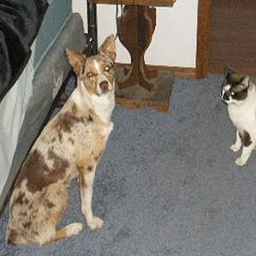
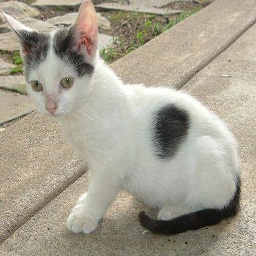
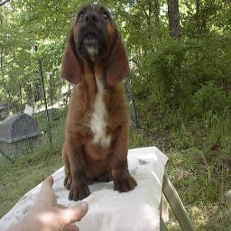
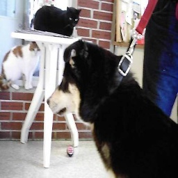
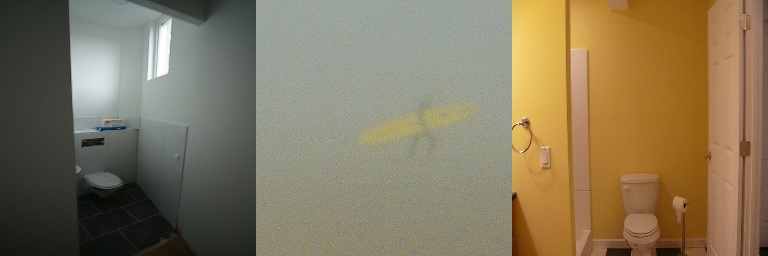
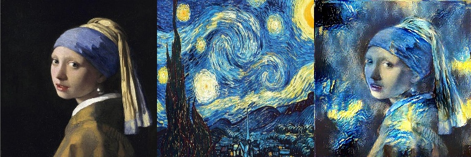
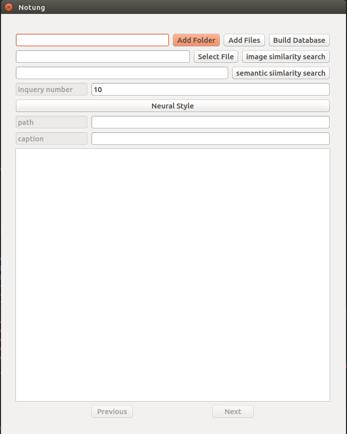
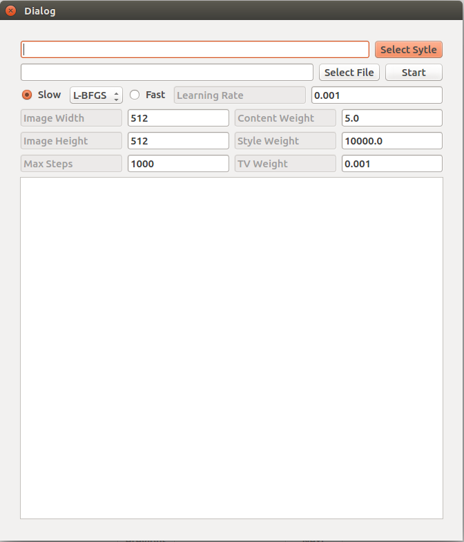

# Notung
## Image cation
Image cation is an interesting field in DL which combines Convolutional Neural Network and Recurrent Neural Network. It first extracts image features by CNN and feeds them into a RNN to generate a description of the image.  
This part is based on Karpathy's [neuraltalk2](https://github.com/karpathy/neuraltalk2) which implemented by Torch. I reimplemented it in Tensorflow and converted the pretrained model. The model contains VGG-16 and LSTM. Maybe Google's [im2txt](https://github.com/tensorflow/models/tree/master/im2txt) is a better choice, but there is no pretrained model available and I don't have a powerful graphic card to train own model. For more details, please see these two repos.
### Some good examples
caption: a cat and a dog are standing in a room  
  
caption: a white and black cat is sitting on the ground  
  
### Some wrong examples
caption: a brown bear sitting on top of a rock  
  
caption: a black and white cat sitting on top of a table  
  
## Image Search
### Image similarity search
In last decades, some features like visual bag of words was developed for image search. But now, almost every search engine uses DL to extract image features automatically. To avoid training a new model, I use the VGG-16 above as feature extractor. But it was finetuned for image caption, so the result is not that good as I thought.   
I use the last pooling layer as the feature and KDTree to search top-k nearest neighbors. The similarity is measured in euclidean distance. I build the database by a subset of MSCOCO with 10000 images. There is an example below.  
query  
  
top-3 inqueries  
 
### semantic similarity search
Using captions as keywords, it is easily to search similar images containing same objects.  
As we know, keyword search is a complex optimization problem. I simply use weighted sum as objective function that all nouns and verbs with 1.0, adjectives and adverbs with 0.5 and all others with 0.1. The larger the weighted sum is, the more similar. There is an example below.  
query  
*a red car*  
top-3 inqueries  
  
## Neural Style
### Neural Style
The first nice neural style work is this [paper](https://arxiv.org/abs/1508.06576) which combines content features and style well and sovle it as optimization problem. For more details, you can see jcjohnson's [repo](https://github.com/jcjohnson/neural-style) implemented by Torch.
#### An example
I use the famous painting *Girl with a Pearl Earring* as content and *The Starry Night* as style.  

### Fast Neural Style
jcjohnson improved the neural style by training a transform Net which transfer a style into images in real time.([paper](https://arxiv.org/abs/1603.08155) and [repo in Torch](https://github.com/jcjohnson/fast-neural-style))  
I reimplemented it in Tensorflow, but I hadn't trained an usable model because it would take too much time on my graphic card. I have no enough time for experiments to find good hyperparameters by now, and I will do it in the future.  
You can see this [repo](https://github.com/lengstrom/fast-style-transfer) also implemented in Tensorflow.  
### Some Others
This is a [fancinating implementation of Neural Style](https://github.com/cysmith/neural-style-tf) in Tensorflow  
This is an [implementation](https://github.com/rtqichen/style-swap) in Tensorflow of the [paper](https://arxiv.org/abs/1612.04337) which can transfer arbitrary style.
## GUI
A simple GUI was wrote which contains all the methods above.  
  
  
## Requirement
* tensorflow
* PIL
* numpy
* sklearn
* nltk
* PyQt4  

This is the [pretrained model](https://pan.baidu.com/s/1o8vx0DW), place it in the root.(I will also find an online disk out of chinese mainland.)

## Acknowledgement
Some ideas are borrowed from:
* [karpathy's neuraltalk2](https://github.com/karpathy/neuraltalk2)
* [jcjohnson's neural style](https://github.com/jcjohnson/neural-style)
* [jcjohnson's fast neural style](https://github.com/jcjohnson/fast-neural-style)
* [lengstrom's fast neural style](https://github.com/lengstrom/fast-style-transfer)
